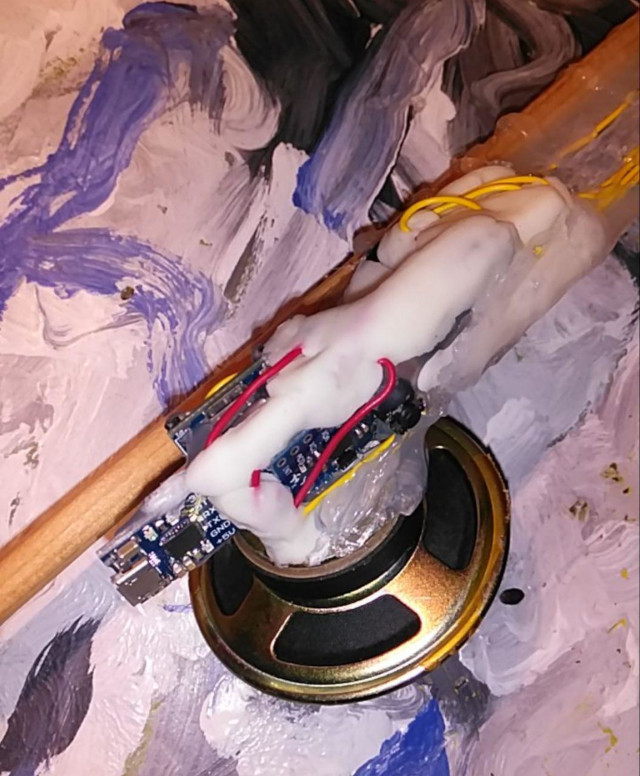
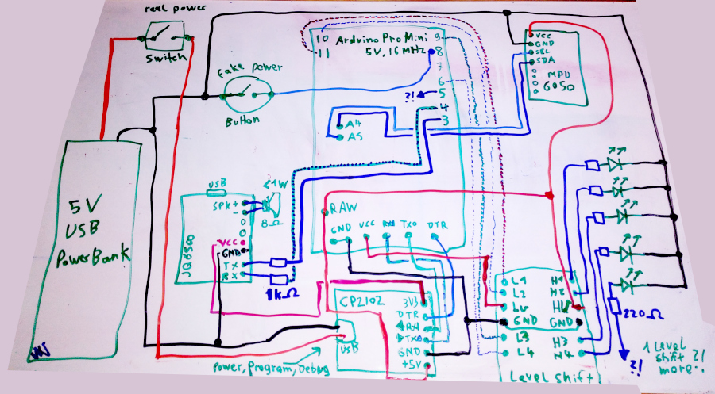

# Lightsword

It is a low cost version (Arduino pro mini, MPU6050 gyroscope, JQ6500 MP3 player) to play
sounds and control LEDs via movement (acceleration).

## Bugs

- it is not very sensitive
- there is a to big DELAY between move (or hit) and sound change

I add a CP2102 chip to burn new code and debug it.

## Features

- switch on an off-sound
- sound changes on fast movement
- sound changes on hit
- 4 or 5 LEDs simulates build/switch laser on and off
- low cost parts

## Picture

## Circuit

